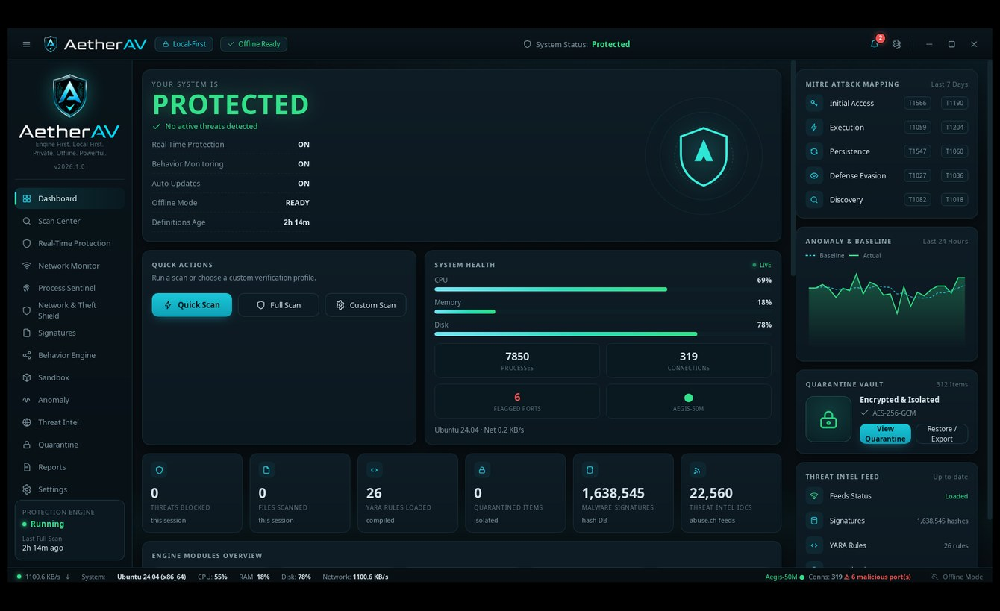
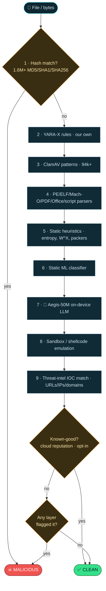
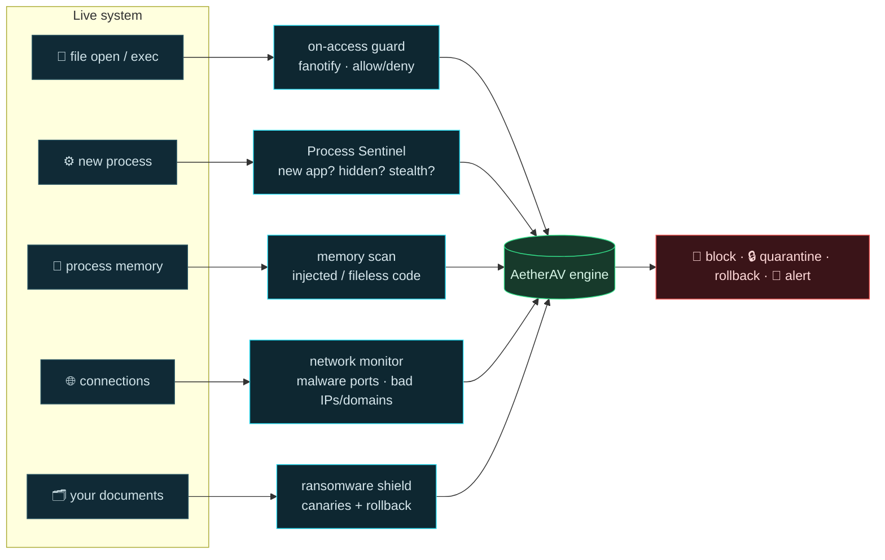
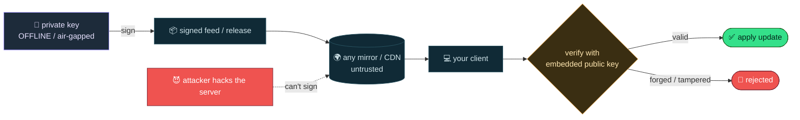
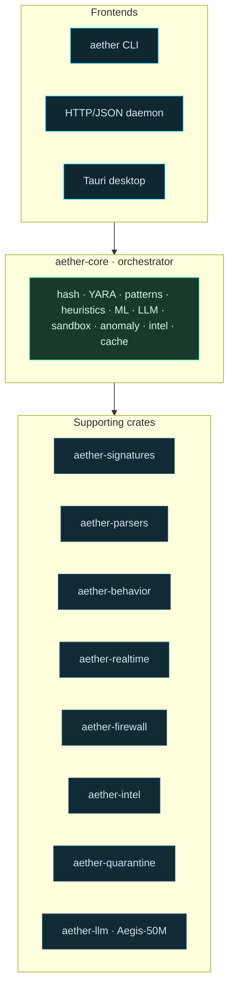

<div align="center">


### A modern, open-source antivirus **engine** in Rust - local-first, privacy-first, and built for the 2026 threat landscape.

*Polymorphic · fileless · living-off-the-land · ransomware · AI-generated malware.*

**Free. Auditable. Tamper-proof updates. On-device AI.**

[](https://github.com/MaliosDark/AetherAV/actions/workflows/ci.yml)
[](https://scorecard.dev/viewer/?uri=github.com/MaliosDark/AetherAV)
[](LICENSE)
[](https://www.rust-lang.org)

<sub>Badge readiness: [docs/OPENSSF.md](docs/OPENSSF.md). The OpenSSF Best-Practices badge will be added after registering the project at bestpractices.dev.</sub>

<br/>



</div>

---

## Why AetherAV?

Most antivirus software asks you to *trust a black box* that has deep access to
your computer. AetherAV flips that: **every line is open** so you can verify it
isn't spying on you - yet it's **not easy to bypass**, because its security comes
from cryptography and behavior analysis, not from hiding its code.

| | AetherAV |
|---|---|
| 🔓 **Open source** | Read it, audit it, build it yourself - bit-for-bit reproducible. |
| 🔌 **Local-first** | Works fully offline. Cloud features are opt-in. |
| 🧠 **On-device AI** | A compact 50M model (**Aegis-50M**) classifies threats on your CPU - no data leaves your machine. |
| 🧬 **Multi-layer** | 10 independent detection engines; beating one isn't enough. |
| 🔏 **Tamper-proof updates** | Ed25519-signed feeds & model - a hacked server *can't* push you malware. |
| 🕵️ **Anti-stealth** | Catches fileless code, hidden (rootkit) processes, and ransomware in the act. |
| 💰 **Anti-theft** | Wallet/credential decoys, in-memory key-scraping detection, and a clipboard hijack guard. |
| 🧱 **Network defense** | A threat-intel firewall and private web/phishing blocking, driven from your OS's own firewall. |
| 📦 **Real installers** | Native installers for Windows, macOS and Linux (x86_64 + ARM) - no bloatware, no upsells, hash-verifiable. |

> **vs ClamAV:** AetherAV adds an on-device LLM, behavioral + anti-rootkit +
> anti-ransomware engines, and cryptographically signed updates - things the
> classic open-source AV doesn't have.

---

## 🔬 How a scan works

Every file flows through independent engines. An exact hit short-circuits
instantly; otherwise the layers vote and the **worst verdict wins**.



After this big rework, false positives on a clean-binary test dropped from
**~40% -> ~0%** while detection stayed **100%** (internal `aether eval`).

---

## 🛰️ Real-time protection

Beyond scanning files, AetherAV watches the live system and can **block threats
before they run**.



- **Process Sentinel** - flags any *new* app by its hash (not its name, which
  malware spoofs) and detects **hidden processes** via cross-view (a userland
  rootkit can't hide from it). Optional kernel-sourced live exec stream (`cn_proc`).
- **Ransomware shield** - plants canaries, detects mass-encryption, and **rolls
  your files back** from a snapshot.
- **Memory scan** - catches fileless / injected code (W^X, unbacked exec maps),
  and harvested **wallet keys / seed phrases / cloud creds** (stealer scraping).
- **Threat firewall** - blocks connections to malicious IPs / RAT-C2 ports via
  your OS's own firewall (nftables / netsh / pf), driven by our signed intel.
- **Web / phishing protection** - sinkholes malicious domains locally in the
  hosts file. No cloud, fully private (the big suites send every URL to theirs).
- **Stealer & wallet shield** - plants decoy wallet/credential files; any read is
  a near-certain infostealer, blocked at the source.
- **Clipboard guard** - detects crypto-address hijackers ("clippers") and
  restores your original address.
- **Anti-exploit** - flags exploit staging (NOP sleds, heap spray, stack-pivot
  gadgets, egg-hunters) in payloads and documents.

---

## 🔏 Updates you can't be tricked into trusting

The #1 risk for any AV is a poisoned update channel. AetherAV signs every feed
and release with an **Ed25519 key kept offline**. Your client carries only the
**public** key. A compromised server, CDN, or man-in-the-middle **cannot forge
an update** - the client simply rejects it.



---

## 🤝 Community protection - without giving up your privacy

Sharing new malware makes everyone safer, but it must not expose *you*. So it's
**opt-in**, **anonymous**, and **send-only** - and the analysis server **never
executes** what it receives.

```mermaid
flowchart LR
    U[💻 user · opt-in] -->|hashes/IOCs<br/>sample only with consent| ING[🚪 ingestion<br/>never executes · anonymized]
    ING --> Q[(queue)]
    Q --> AN[🧪 analysis worker<br/>isolated · NO network]
    AN --> SIG[📝 new signatures]
    SIG -->|🔏 signed offline| FEED[📦 signed feed]
    FEED --> ALL[🌐 every user gets better detection]

    classDef u fill:#0e2731,stroke:#27d8ee,color:#d6e6ec
    classDef srv fill:#102a36,stroke:#2a5563,color:#cfe2e8
    classDef iso fill:#3a1418,stroke:#ef5350,color:#ffd9d9
    classDef good fill:#34e08a,stroke:#1b5e20,color:#04261a
    class U u
    class ING,Q,SIG,FEED srv
    class AN iso
    class ALL good
```



By default **nothing leaves your machine**. See [server/README.md](server/README.md).

---

## 📦 Install

Real installers for **every OS and CPU architecture** - with a license step,
component selection, and real-time protection set up for you. No bloatware, no
upsells. Grab the one for your system from the [latest release](https://github.com/MaliosDark/AetherAV/releases/latest).

| OS | Installer(s) | Architectures | Real-time |
|----|--------------|---------------|-----------|
| **Windows** | `AetherAV-Setup-*.exe` wizard (license · components · PATH · shortcuts · context menu) | x86_64 · arm64 | on-access watcher auto-started (kernel minifilter scaffolded) |
| **macOS** | `.pkg` wizard, or a drag-to-Applications `.dmg` | universal (Intel + Apple Silicon) | LaunchDaemon |
| **Linux** | `.deb` package, or the `install.sh` wizard / `.tar.gz` | x86_64 · aarch64 | systemd service (fanotify) + hourly signed updates |

### ⚠️ Read this before installing - it's unsigned *on purpose*

AetherAV is **not** signed with a paid OS code-signing certificate. That's a
deliberate choice, not a shortcut. A paid certificate only proves *"someone paid
a Certificate Authority and verified their identity"* - it says **nothing** about
whether the code is safe, and it can't be audited. Instead, AetherAV gives you a
**stronger, free trust path**: **reproducible builds + an Ed25519-signed
`SHA256SUMS`**. You (or anyone) can prove the binary came from this exact source -
something a paid-signed black box can't offer. See [docs/VERIFY.md](docs/VERIFY.md).

The only cost of skipping the paid cert is that **your OS will show a warning**
and installation **needs administrator / root** (it installs a real-time security
service - any AV does). Here's exactly how to proceed on each system:

- **🪟 Windows** - double-click `AetherAV-Setup-*.exe`. SmartScreen may say
  *"Windows protected your PC"* → click **More info → Run anyway**. Approve the
  **UAC / "Run as administrator"** prompt (needed to install the real-time service).
- **🍎 macOS** - the `.pkg`/`.dmg` is from an *"unidentified developer"*.
  **Right-click the file → Open → Open** (don't double-click), or run
  `xattr -dr com.apple.quarantine <file>`. Installing the system service asks for
  your password.
- **🐧 Linux** - install and real-time protection need **`sudo`**:
  `sudo apt install ./aetherav_*_*.deb` (or `sudo ./install.sh`). The CLI gets
  the capabilities it needs for fanotify/firewall; full on-access still uses `sudo`.

> **Always verify what you downloaded** (takes 5 seconds and beats any cert):
> ```bash
> sha256sum -c SHA256SUMS          # bytes match the published hashes
> aether verifyfile SHA256SUMS     # the hash list is Ed25519-signed by us -> ✓ TRUSTED
> ```

Prefer to build it yourself? Every installer is reproducible from source:
`installer/windows/build.ps1` · `installer/macos/build-pkg.sh` ·
`installer/linux/build-deb.sh` (or `installer/linux/install.sh`). A tagged release
builds all of them for every architecture via GitHub Actions - see
[docs/RELEASE.md](docs/RELEASE.md).

---

## 🚀 Quick start (from source)

```bash
# build
cargo build --release          # binary: target/release/aether

# scan a file or folder
aether scan ./Downloads -r

# real-time + advanced (Linux; some need root)
aether sentinel --learn        # learn a clean baseline of running apps
aether sentinel                # detect NEW / hidden / stealth processes
aether memscan                 # scan process memory for injected/fileless code
aether ransomguard ~/Documents # ransomware shield with rollback
sudo aether protect /          # kernel on-access blocking (fanotify)
aether netscan                 # live connections vs malware-port DB

# anti-theft & exploit defense
aether memscan --secrets                 # flag harvested wallet keys/seeds in memory
sudo aether stealerguard ~ --arm --watch --kill   # decoy traps + block infostealers
aether clipguard --watch --restore       # crypto clipboard-hijack guard
aether exploitscan suspicious.bin        # exploit-staging indicators (sleds, ROP, ...)

# network defense (prints rules; --apply installs into the OS firewall, needs admin)
sudo aether firewall --apply             # block malicious IPs/ports (nftables/netsh/pf)
sudo aether webprotect --apply           # block phishing/malware domains (hosts file)

# threat intel & reputation
aether intel ...               # manage feeds
aether reputation <file|hash>  # cloud known-good lookup (CIRCL, no key)
aether cve CVE-2021-44228      # vulnerability lookup
aether vt-scan <file>          # VirusTotal-contributor scan format

# run the engine as a service, or the desktop app
aether serve                   # HTTP/JSON API
./desktop/run.sh               # cross-platform GUI dashboard
```

Exit codes follow the ClamAV convention (`0` clean, `1` threat found).

---

## ✅ Verify your download (don't just trust us)

```bash
sha256sum -c SHA256SUMS        # binary matches the published hash
aether verifyfile SHA256SUMS   # the hash list is signed by our offline key -> ✓ TRUSTED
```

Or rebuild from source and compare: `./tools/reproducible-build.sh`.
Full details: [docs/VERIFY.md](docs/VERIFY.md).

---

## 🧱 Architecture

A Rust workspace of focused crates; the **engine** is the core that every
frontend (CLI, daemon, desktop) builds on.



**Detection content:** ~1.64M file hashes · **our own** YARA-X rules · 94k+
pattern signatures · the Aegis-50M model · live abuse.ch / CIRCL intel.

> **We own our detection content.** The default install ships only rules we
> wrote, plus databases we ingest and re-sign ourselves - so our protection
> never depends on a third-party rule server that could be compromised. An
> optional community YARA pack exists (`tools/import_yara.py` -> `assets/
> community-rules/`) but is **not loaded by default**; review it before trusting
> it. YARA rules are data, not code, so a poisoned rule could at worst cause
> false positives - never run code on your machine.

---

## 🔒 Open source *and* hard to bypass

Being open is a **trust advantage** for an AV, not a weakness. Our defenses
don't depend on secret code:

- **Cryptographic integrity** - signed updates & releases (forgery needs the
  offline key, not the source).
- **Behavioral detection** - malware can't hide *what it does* at runtime by
  reading our rules (encryption, injection, hidden processes, C2).
- **Defense in depth** - 10 layers; evading one isn't enough.
- **Constantly-updated content** - a static evasion goes stale fast.

Read the full threat model and disclosure policy in [SECURITY.md](SECURITY.md).

---

## 🗺️ Status & roadmap

**Done:** 10 detection engines · on-device AI (Aegis-50M) · real-time protection
(on-access, sentinel, memory, ransomware rollback) · **threat firewall + web
protection (3 OS)** · **anti-stealer / anti-clipper / memory key-scraping** ·
**anti-exploit** · **Authenticode publisher detection** · signed feed + model
updates · anonymous submission pipeline · desktop GUI with **system tray +
widget** · **native installers for every OS + CPU arch (Windows / macOS / Linux,
x86_64 + ARM) + CI** · **Ed25519-verifiable releases** ·
**VirusTotal-contributor package** · marketing website (`web/`) · reproducible
builds.

**Next:** ship the Windows kernel minifilter + macOS EndpointSecurity · deploy
the public feed server · grow detection content. We intentionally **skip paid OS
code-signing** - trust comes from reproducible builds + Ed25519-signed releases,
not from a Certificate Authority (see [docs/VERIFY.md](docs/VERIFY.md)).

## 📜 License

AetherAV is open source under the **Apache License 2.0** - see [`LICENSE`](LICENSE).

<div align="center"><sub>Built to be trusted: read it, build it, verify it.</sub></div>
